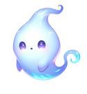
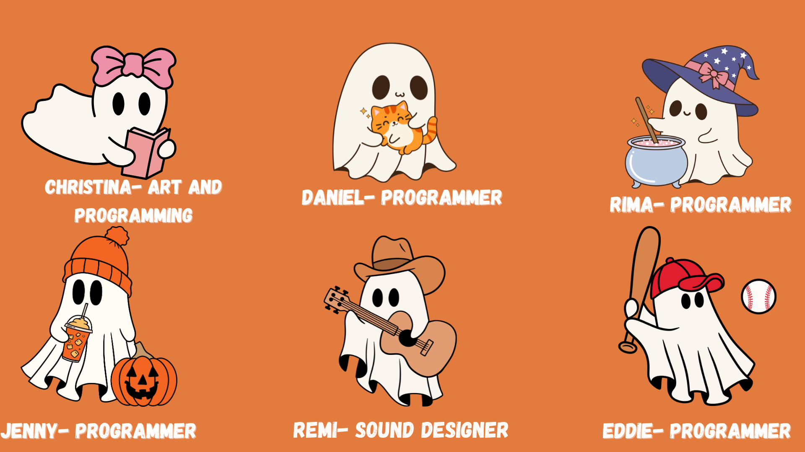

#  My Pet Monsters

Fall 2024 Game Jam at the University of New Orleans via IGDA! This Game Jam's theme was <i><strong>Creatures</strong></i>.

# Demo & Play

📌 See our demo [here](https://youtu.be/ZUOERl2Ovzs)! \^.^ 
📌 Play our game on [itch.io](igda-uno.itch.io/my-pet-monster)! >.<

# Collaborators

### Programmers

* Eddie Castro– [LinkedIn](https://www.linkedin.com/in/eacastr1/) | [@eacastr1](https://github.com/eacastr1) on GitHub
* Jenny Spicer– [LinkedIn](www.linkedin.com/in/jenspi) | [Portfolio](http://jenspi.github.io)
* Rima Murad– [LinkedIn](https://www.linkedin.com/in/rima-murad/) | [@Rima-Murad](https://github.com/Rima-Murad) on GitHub
* Daniel Nguyen– [LinkedIn](https://www.linkedin.com/in/daniel-nguyen-541530226/) | [@thisisdaniel1](https://github.com/thisisdaniel1) on GitHub
* Christina Scavo– [LinkedIn](https://www.linkedin.com/in/cscavo/) | [Portfolio](https://sites.google.com/view/christinascavo/home/)

### Assets

* **[ART]** Christina Scavo– [LinkedIn](https://www.linkedin.com/in/cscavo/) | [Portfolio](https://sites.google.com/view/christinascavo/home/)
* **[MUSIC]** Remi Robinson– [LinkedIn](https://www.linkedin.com/in/richard-robinson-ba0b92266/)

### Acknowledgements

* itch.io
